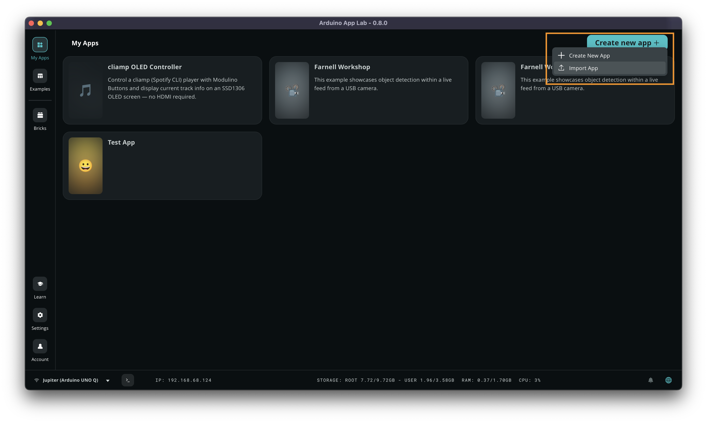
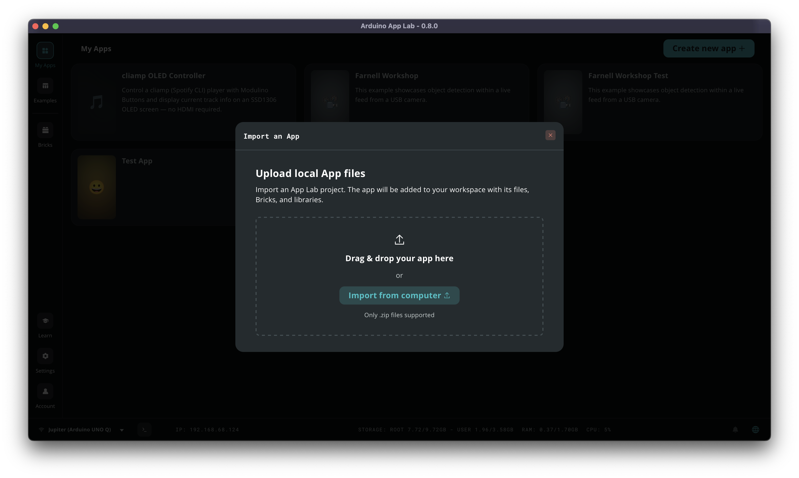
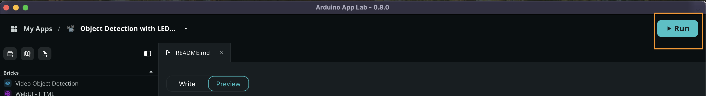
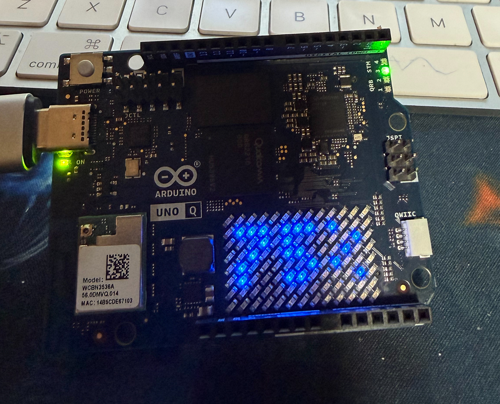

# cv-workshop-example

This repository contains a complete App for the **Arduino App Lab**.

The App demonstrates how to run inference on a live camera feed, using the **Video Object Detection** brick, paired with a an AI model (default is face detection, more available to choose from in the Arduino App Lab).

## Hardware Required

- [Arduino UNO Q](https://www.arduino.cc/product-uno-q)
- USB-C hub
- USB-C cable for powering the hub (e.g. via computer USB port)
- Generic USB web camera

## Example

The code for the example is available in the `object-detection-example` folder. The `.zip` file is also available so that you can directly import it into Arduino App Lab.

## How to Use It

Clone this repository and follow the steps below:

1. Download [Arduino App Lab](https://www.arduino.cc/en/software/#app-lab-section)
2. Connect your Arduino UNO Q to the computer via USB-C. The first setup requires a USB-C connection, where you will be configuring Linux OS password as well as Wi-Fi credentials.
3. After first configuration is completed (you may need to update the board too), disconnect the board from the computer.
4. Connect the USB-C hub to the UNO Q, connect the camera to the USB hub and power the USB hub, following the image below:

5. Launch Arduino App Lab again, and select the board. If the board is on the same network, it should appear.
6. Click "Create New App" (top right corner) and import the `.zip` found in this repository.
   
   
7. Launch the app.
   
8. A browser window will automatically open at `<board-ip>:7000` where the UI of the camera will be displayed.
9. The confidence will be displayed in **%** on the LED Matrix on the UNO Q, demonstrating the communication between the QRB2210 MPU and the STM32 MCU.

## Example Documentation

A more detailed explanation of the example is provided in the examples `README.md` located inside the `obejct-detection-example` folder.

## Reference

This example is based on the [Detect Objects on Camera](https://github.com/arduino/app-bricks-examples/tree/main/examples/video-generic-object-detection) example.

